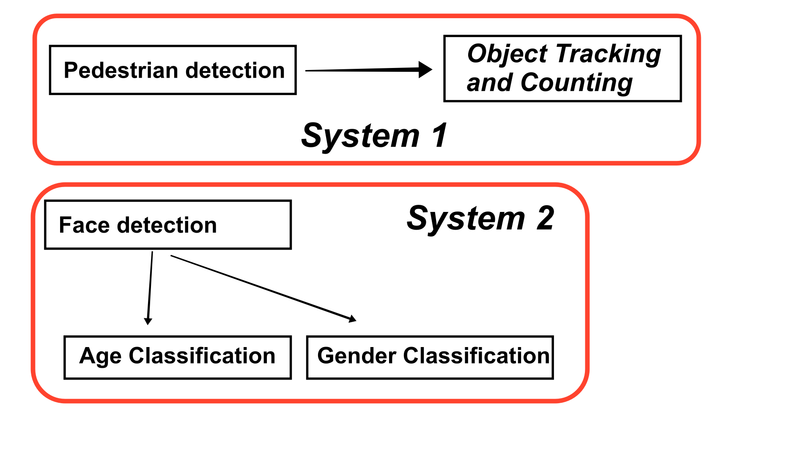
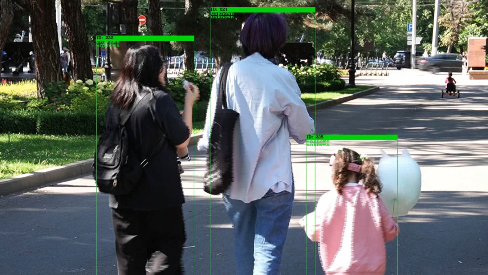
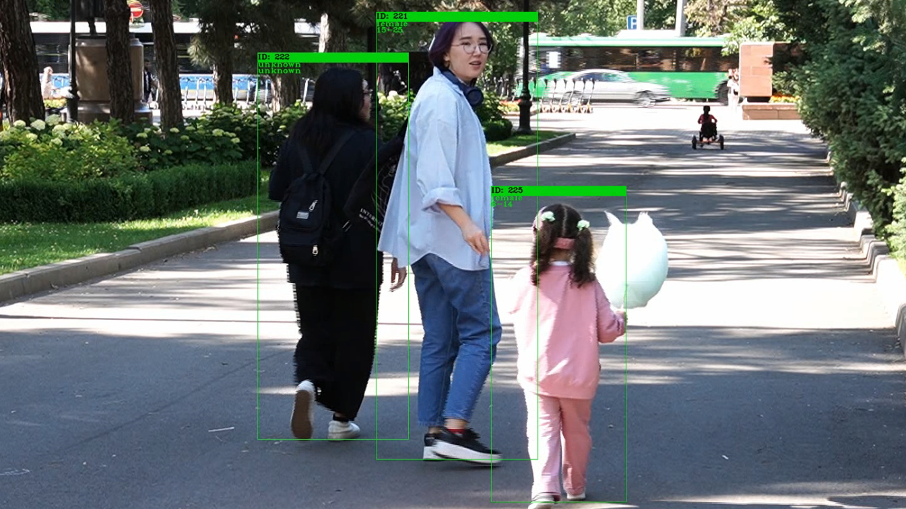
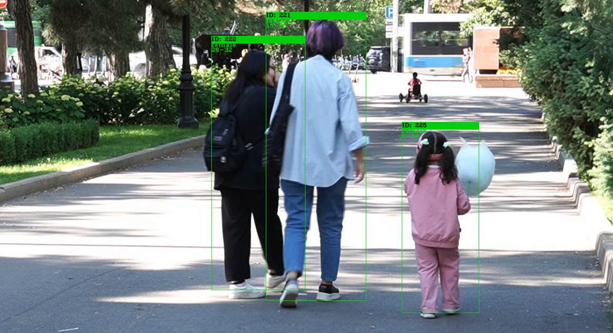

</img>
# Viy
Viy is a real-time human counting software with age estimation and gender classification.

### Software architecture

</img>

The software architecture consists of two systems shown in the figure above. Each system has its own purpose.

Mainly, `System 1` is responsible for pedestrian detection and tracking. `System 2`, on the other hand, consists of a face detection, age estimation and gender classification modules.

The work process of `System 1` is simple: the program determines its target, then generates a unique ID and assigns it to the target. Once an ID has been assigned, the system starts tracking the targeted object across the frame incrementing the pedestrian counter.

Afterwards, `System 2` detects a new object – a human face. If a human face is not visible or is fragmented, it ignores the target and returns to `System 1`. If a face was successfully detected, it extracts the face from a frame and classifies its gender and estimates its age.

### Field tests

#### Pedestrian detection
Once the object has been detected, a unique ID is assigned. As for the pedestrian's gender and age - its `unknown` until the program 'catches' his/her face.

</img>

#### Age and Gender classification
At this points, it is able to detect pedestrian's face and classify its gender and estimate its approximate age.

</img>

Note:

* `ID: 222` wasn't classified as there is no face;
* `ID: 221` was classified as `female` and `15-25` years old;
* `ID: 225` was classified as `female` and `6-14` years old.

#### Pedestrian tracking
The software then continues to track pedestrians saving the gender and age data.

</img>

### Results
The program stores all data into a `csv` or `excel` file. It's configurable. The results summary is saved in the following format:

Date|Hour|#people|#males|#females|mode(age)
--- | --- | --- | --- | --- | ---
14/06/2022|09|19|3|5|15-25
14/06/2022|10|16|2|3|33-41
14/06/2022|11|16|5|2|15-25

### Limitations
There are many limitations in the software, and its mostly due to the computer power available. More powerful computers allow for powerful more accurate algorithms. However, when one does not have a powerful PC at hand, most of the time its better to settle for speed. There's a constant trade off between the two. Nonetheless, the software is highly extensible. One module may be almost seamlessly replaced with another.

### LICENSE
All code is licensed under MIT license.
